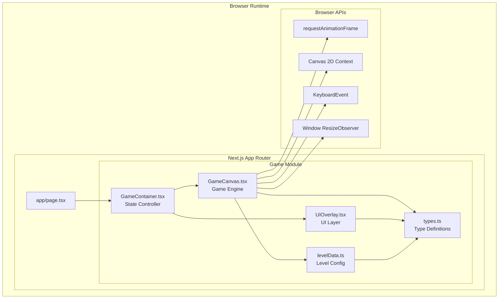
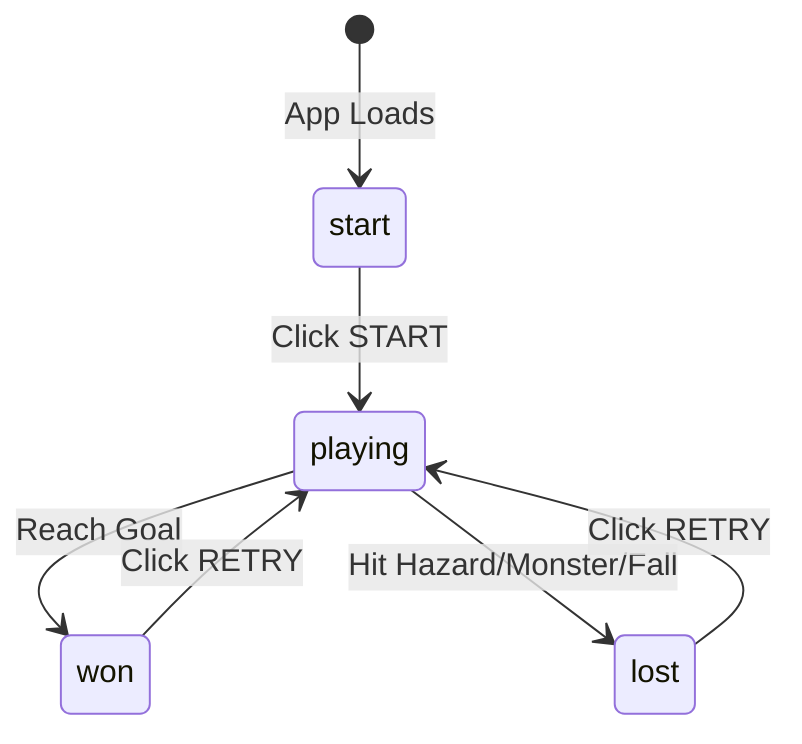
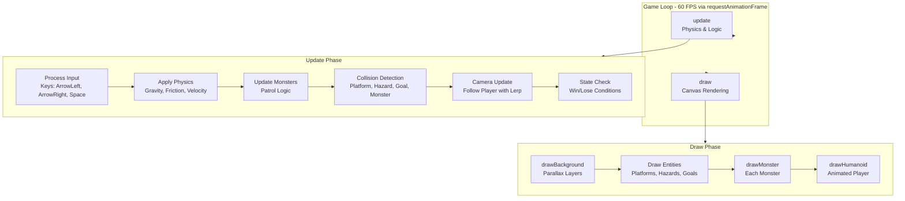
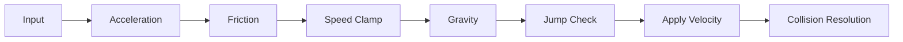
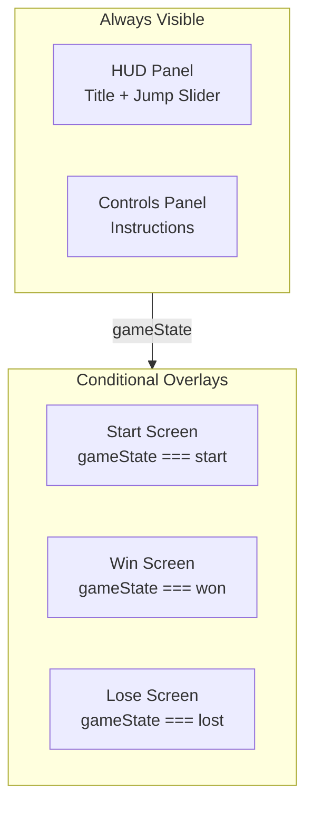
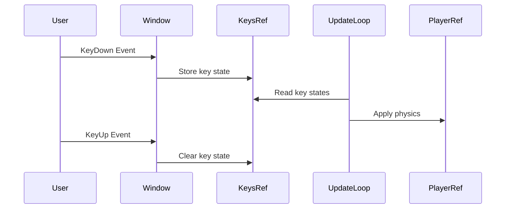
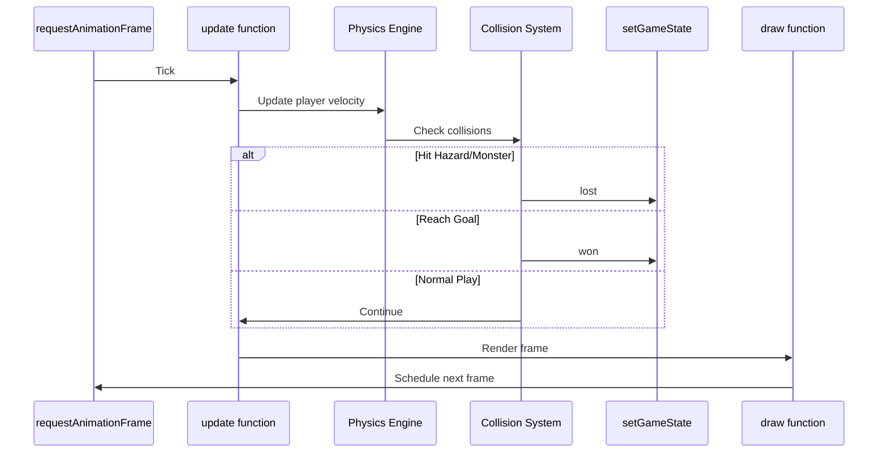

# Kilo Man - Application Architecture Documentation

## Executive Summary

**Kilo Man** is a browser-based 2D side-scrolling platformer game built with modern web technologies. The game features a humanoid character navigating through hazardous terrain, avoiding patrolling enemies, and reaching a goal to complete each level. All graphics are procedurally rendered using HTML5 Canvas, requiring no external sprite assets.

---

## Technology Stack

| Layer | Technology | Version |
|-------|-----------|---------|
| Framework | Next.js | 15.0.3 |
| UI Library | React | 19.0.0-rc |
| Styling | Tailwind CSS | v4 |
| Type System | TypeScript | ^5 |
| Rendering | HTML5 Canvas | Native |
| Language | ECMAScript | 2022 |

---

## System Architecture

### High-Level Component Diagram



---

## Component Architecture

### 1. Entry Point: [`app/page.tsx`](app/page.tsx)

The root page component that serves as the application entry point.

**Responsibilities:**
- Renders full-screen viewport container
- Mounts the GameContainer component
- Applies global styling (black background, overflow hidden)

**Structure:**
```typescript
export default function Home() {
  return (
    <main className="w-screen h-screen overflow-hidden bg-black">
      <GameContainer />
    </main>
  );
}
```

---

### 2. State Controller: [`GameContainer.tsx`](app/components/Game/GameContainer.tsx)

The primary state management component using React hooks.

**State Management:**

| State | Type | Purpose |
|-------|------|---------|
| `gameState` | `GameStatus` | Tracks game lifecycle: start, playing, won, lost |
| `jumpModifier` | `number` | Player-adjustable jump power multiplier (0.5-2.0) |
| `completionData` | `CompletionData \| null` | Stores finish time and calculated points |
| `startTimeRef` | `ref<number>` | Tracks when gameplay began |

**State Flow Diagram:**



**Scoring Algorithm:**
```typescript
const calculatePoints = (timeInSeconds: number): number => {
  const basePoints = 10000;
  const pointsPerSecond = 100;
  return Math.max(1000, basePoints - Math.floor(timeInSeconds * pointsPerSecond));
};
```

---

### 3. Game Engine: [`GameCanvas.tsx`](app/components/Game/GameCanvas.tsx)

The core game engine responsible for physics, rendering, and game logic.

#### 3.1 Configuration Constants

```typescript
const CONFIG: GameConfig = {
  gravity: 0.6,      // Downward acceleration per frame
  friction: 0.85,    // Horizontal velocity decay
  moveSpeed: 0.8,    // Horizontal acceleration
  maxSpeed: 8.0,     // Maximum horizontal velocity
  baseJumpForce: -14, // Upward velocity on jump
  levelWidth: 7000,  // World width in pixels
};
```

#### 3.2 Game Loop Architecture



#### 3.3 Physics System

**Player State Interface:**
```typescript
interface PlayerState {
  x: number;           // World X position
  y: number;           // World Y position
  vx: number;          // Horizontal velocity
  vy: number;          // Vertical velocity
  width: number;       // Hitbox width (30px)
  height: number;      // Hitbox height (50px)
  isGrounded: boolean; // Can jump when true
  facing: 1 | -1;      // Direction facing
  frame: number;       // Animation frame counter
}
```

**Physics Update Flow:**


#### 3.4 Collision Detection

**Algorithm:** Axis-Aligned Bounding Box (AABB)

```typescript
// AABB Overlap Check
if (
  player.x < entity.x + entity.w &&
  player.x + player.width > entity.x &&
  player.y < entity.y + entity.h &&
  player.y + player.height > entity.y
) {
  // Collision detected
}
```

**Resolution Strategy:**
1. Calculate overlap on both axes
2. Resolve the axis with smaller overlap
3. Reset velocity on resolved axis

#### 3.5 Camera System

**Features:**
- Smooth follow using linear interpolation (lerp)
- X-axis clamping to prevent showing out-of-bounds
- Y-axis deadzones for stable ground-level viewing
- Vertical tracking when climbing high or falling deep

```typescript
// Smooth Camera Lerp
cameraRef.current.x += (targetX - cameraRef.current.x) * 0.1;  // 10% per frame
cameraRef.current.y += (targetY - cameraRef.current.y) * 0.05; // 5% per frame (slower)
```

#### 3.6 Rendering Pipeline

**Layer Order (Back to Front):**

1. **Background** - Sky gradient, parallax stars, mountains, hills
2. **Platforms** - 3D-style blocks with gradient shading
3. **Hazards** - Red spike triangles
4. **Goals** - Green rectangles with white border
5. **Monsters** - Red diamond shapes with eyes
6. **Player** - Animated humanoid with shadow

**Parallax Factors:**

| Layer | Parallax Factor | Visual Effect |
|-------|-----------------|---------------|
| Stars | 0.1 | Very slow movement |
| Far Mountains | 0.2 | Slow movement |
| Near Hills | 0.5 | Medium movement |
| Kilo Logo | 0.05 | Subtle drift |

---

### 4. UI Layer: [`UIOverlay.tsx`](app/components/Game/UIOverlay.tsx)

Handles all user interface elements overlaid on the game canvas.

**UI States:**



**Interactive Elements:**
- Jump power slider (range: 0.5 - 2.0, step: 0.1)
- Start/Retry buttons

---

### 5. Type Definitions: [`types.ts`](app/components/Game/types.ts)

Centralized TypeScript interfaces for type safety.

```typescript
// Entity Types
export type EntityType = 'platform' | 'hazard' | 'goal' | 'start' | 'monster';

// Level Entity Definition
export interface LevelEntity {
  id: string;
  x: number;
  y: number;
  w: number;
  h: number;
  type: EntityType;
  color?: string;
  patrolStart?: number;  // Monster-specific
  patrolEnd?: number;    // Monster-specific
  speed?: number;        // Monster-specific
}

// Game States
export type GameStatus = 'start' | 'playing' | 'won' | 'lost';

// Runtime Monster State
export interface MonsterState {
  id: string;
  x: number;
  y: number;
  w: number;
  h: number;
  vx: number;
  patrolStart: number;
  patrolEnd: number;
  speed: number;
}
```

---

### 6. Level Data: [`levelData.ts`](app/components/Game/levelData.ts)

Static level configuration defining world layout.

**Level 1 Structure:**

```mermaid
flowchart LR
    subgraph Section1["Section 1: Tutorial<br/>0-1000px"]
        S1A[Ground Level]
        S1B[Intro Steps]
        S1C[First Hazard]
        S1D[First Monster]
    end
    
    subgraph Section2["Section 2: The Climb<br/>1000-2500px"]
        S2A[Vertical Platforms]
        S2B[Peak at y=150]
        S2C[Descent]
        S2D[Fast Monster]
    end
    
    subgraph Section3["Section 3: The Gap<br/>2500-4000px"]
        S3A[Massive Pit Hazard]
        S3B[Small Precision Platforms]
    end
    
    subgraph Section4["Section 4: Monster Alley<br/>4000-5500px"]
        S4A[Ground with 3 Monsters]
        S4B[Optional High Path]
    end
    
    subgraph Section5["Section 5: Final<br/>5500-7000px"]
        S5A[Stairs]
        S5B[Final Guard Monster]
        S5C[Goal]
    end
    
    Section1 --> Section2 --> Section3 --> Section4 --> Section5
```



**Entity Distribution:**

| Entity Type | Count | Purpose |
|-------------|-------|---------|
| platform | 28 | Traversable surfaces |
| hazard | 3 | Death zones |
| monster | 7 | Patrolling enemies |
| goal | 1 | Win condition |
| start | 1 | Spawn point |

---

## Data Flow

### Input Processing



### State Update Cycle



---

## File Structure

```
KiloMan/
├── app/
│   ├── page.tsx              # Entry point - renders GameContainer
│   ├── layout.tsx            # Root layout with fonts
│   ├── globals.css           # Global Tailwind imports
│   ├── favicon.ico           # Browser tab icon
│   └── components/
│       └── Game/
│           ├── GameContainer.tsx  # State management layer
│           ├── GameCanvas.tsx     # Core game engine
│           ├── UIOverlay.tsx      # HUD and menus
│           ├── types.ts           # TypeScript interfaces
│           └── levelData.ts       # Level configuration
├── public/
│   └── KiloLogo.png          # Background logo asset
├── package.json              # Dependencies and scripts
├── tsconfig.json             # TypeScript configuration
├── next.config.ts            # Next.js configuration
├── postcss.config.mjs        # PostCSS/Tailwind config
├── eslint.config.mjs         # ESLint configuration
└── architecture_plan.md      # Original design document
```

---

## Key Design Decisions

### 1. Canvas-Based Rendering
**Decision:** Use HTML5 Canvas 2D instead of DOM elements or WebGL.

**Rationale:**
- Full control over pixel-level rendering
- Better performance for real-time animation
- No external dependencies on game engines
- Procedural graphics eliminate asset loading

### 2. Ref-Based State Management
**Decision:** Use `useRef` for mutable game state instead of `useState`.

**Rationale:**
- Avoids re-renders on every frame (60 FPS)
- Direct mutation is faster for game loops
- React state used only for UI-affecting changes

### 3. Static Level Data
**Decision:** Level defined as static TypeScript array.

**Rationale:**
- Simple to modify and extend
- Type-safe entity definitions
- No runtime level loading complexity
- Easy to add new levels

### 4. Integrated Monster AI
**Decision:** Simple patrol-based AI in main update loop.

**Rationale:**
- Predictable behavior for player skill-based gameplay
- No complex AI systems needed
- Patrol ranges defined per-monster in level data

---

## Performance Considerations

| Aspect | Implementation | Impact |
|--------|---------------|--------|
| Frame Rate | `requestAnimationFrame` | Synced to display refresh |
| State Updates | `useRef` mutations | No React re-renders |
| Canvas Size | Dynamic resize listener | Responsive to window |
| Collision Checks | Simple AABB | O(n) per frame |
| Rendering | Single canvas context | Minimal API calls |

---

## Extension Points

### Adding New Levels
1. Create new array in [`levelData.ts`](app/components/Game/levelData.ts)
2. Update level selection logic in [`GameCanvas.tsx`](app/components/Game/GameCanvas.tsx)
3. Add level transition UI in [`UIOverlay.tsx`](app/components/Game/UIOverlay.tsx)

### Adding New Entity Types
1. Add type to `EntityType` union in [`types.ts`](app/components/Game/types.ts)
2. Add collision handling in update loop
3. Add rendering logic in draw function
4. Define entities in level data

### Adding Power-Ups
1. Create `PowerUp` interface in [`types.ts`](app/components/Game/types.ts)
2. Add power-up state to [`GameCanvas.tsx`](app/components/Game/GameCanvas.tsx)
3. Implement collection logic in collision detection
4. Apply effects to physics or rendering

---

## Dependencies

```json
{
  "dependencies": {
    "next": "15.0.3",
    "react": "19.0.0-rc-66855b96-20241106",
    "react-dom": "19.0.0-rc-66855b96-20241106"
  },
  "devDependencies": {
    "@tailwindcss/postcss": "^4",
    "@types/node": "^20",
    "@types/react": "^18",
    "@types/react-dom": "^18",
    "eslint": "^9",
    "eslint-config-next": "15.0.3",
    "tailwindcss": "^4",
    "typescript": "^5"
  }
}
```

---

## Summary

Kilo Man demonstrates a clean separation of concerns in a browser-based game:

- **GameContainer** handles application state and scoring
- **GameCanvas** implements the complete game engine
- **UIOverlay** provides isolated UI rendering
- **types.ts** ensures type safety across components
- **levelData.ts** enables data-driven level design

The architecture prioritizes simplicity and maintainability while delivering responsive, visually appealing gameplay using only native browser APIs and modern React patterns.
